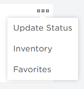

# Discord Guide

Our Community Server

Alpha Authority uses a a variety of platforms in its social network, but our most important one is on a website called discordapp.com, also known as Discord.  
  
Our Discord Server is where our community members can freely communicate with our staff, as well as other players in the Alpha Authority.  
  
All users in our playerbase, MUST join our Discord Server in order to go through our ranks. You'll be able to receive announcements, see all our resources, share memes and your media, overall be up-to-date on our groups' status.  
  
Information on how to join is found below.

## Joining our Discord Server

### Quick Information

* By Joining the Alpha Authority's Discord Server, you are obligated to follow our rules, as well as the Discord Community Guidelines.
* All users who make infractures against our rules, will be moderated according to their moderation history, and due process for moderation.
* Our group officials are not to be disrespected or talked back to, for their moderation upon players, in public, DMs, or any other communication form. 
* If you think a official made a mistake in their moderation, contact someone in the Officer Core or above.
* Thank you for reading

### How to Join:

Joining Discordapp.com

* Go to [https://discordapp.com/login](https://discordapp.com/login)
* Create an Account or Login // Basic Information
  * [https://support.discordapp.com/hc/en-us/articles/219470277-Getting-Started](https://support.discordapp.com/hc/en-us/articles/219470277-Getting-Started)

Requirements to Join AA's Discord

* Verified Email // How to Verify Your Email
  * [https://support.discordapp.com/hc/en-us/articles/216679607-What-are-Verification-Levels](https://support.discordapp.com/hc/en-us/articles/216679607-What-are-Verification-Levels-)
  * [https://support.discordapp.com/hc/en-us/articles/213219267-Resending-Verification-Email](https://support.discordapp.com/hc/en-us/articles/213219267-Resending-Verification-Email)

Joining AA's Discord:

* After logging into your Discord and making sure you have verified your email on your account, join our server using the invite link below. No worries, its hosted by discordapp.com, just a shortened a link.
  * [https://discord.gg/Xqfg4JE](https://discord.gg/Xqfg4JE) // Server Invitation

## Getting Permissions

### Basics

After joining our Discord Server, you'll need to request permissions to join the server. Go to \#request-permissions, read below for further instructions

These are the intial roles you can obtain.

* Required Verification
  * Group Member
  * Ally
* Requestable
  * Guest

### Required Verification

Each role that requires you to verify has a different verification process.

* Group Member:
  * Go to \#request-permissions
  * Say -&gt;verify
  * Say your username
  * Say yes
  * Use the code given in your profile STATUS, not description. At the top right of your profile area on your profile, you can update it through the three dots.

* Ally
  * You just need to show that you're in one of Alpha Authoritys' allies, and it'll be provided. 

### Requestable Roles

You can request for these roles without need of verification, though they will have some channel restrictions.

* Guest

## Getting Access

### Access Agreement

As previously said above,

> By Joining the Alpha Authority's Discord Server, you are obligated to follow our rules, as well as the Discord Community Guidelines.

Our staff has the right to give/take permissions from you at any given time, and it is essential that if you want to stay in our server, that you adhere to our rules. We just want to have a good time, and not have too much hastle or conflict with others.

Gaining access is as simple as the agreement you make, by reacting to the message found in the access channel. By reacting, you'll have access to our community and be able to see our resources, services, activity, developements, events, and much more. 

We hope you enjoy being apart of our Community & Communications server, thank you for reading!  

Sincerely,  
Overlord Scrizeebe

